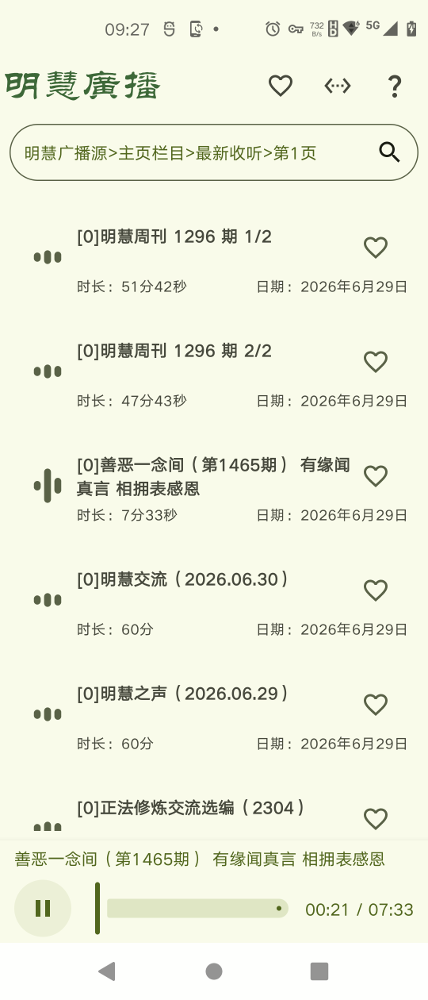
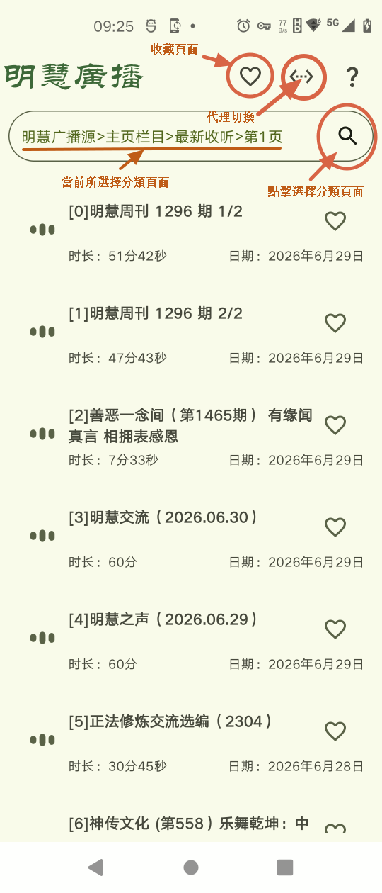
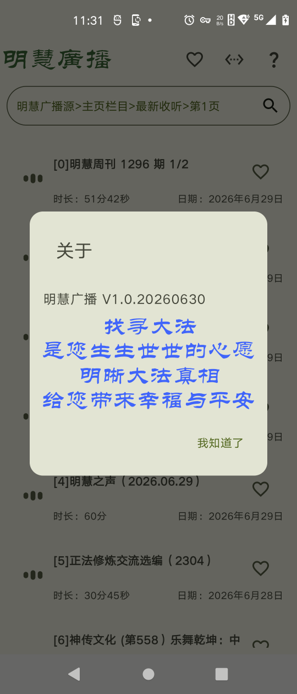
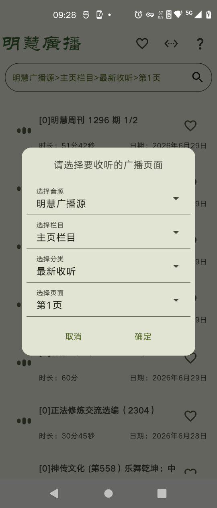
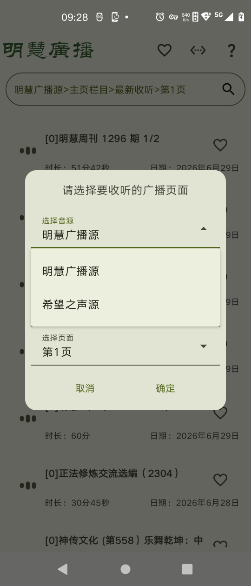
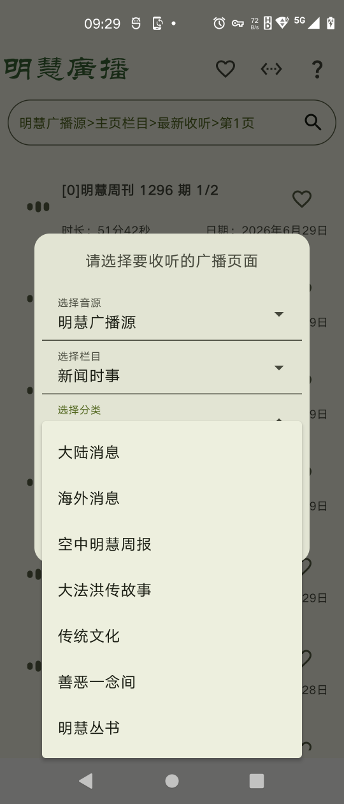

# “明慧廣播”使用簡要説明

## 一、程序簡介

本程序藉助Android版自由門VPN或無界一點通具備的代理功能，以明慧廣播（www.mhradio.org）和希望之聲（mp3.soundofhope.org/mhradio/）為數據源，實現在Android手機或平板（适合Android 7及以上系统）等移動設備端播放明慧廣播MP3節目的功能。程序使用簡潔、安全。详细功能如下：
1.	所有的網絡訪問通過代理實現，無直連之憂，因此無安全疑慮。即使自由門VPN或無界一點通意外退出，也無安全隱患。
2.	針對使用設備，手機或平板的顯示及系統主題，做了適配。
3.	提供收藏功能，可以保留用戶最喜愛的節目。

内容豐富的明慧廣播節目，讓人們有機會全面瞭解大法真相，以給自己選擇美好的未來。

本程序的數據來自兩個源：明慧廣播官網和希望之聲。兩者主要區別是：明慧廣播官網的MP3節目，大約在2021年開始才提供32Kbps的較低碼率的節目，之前為高碼率的（大概是128Kbps）節目；而希望之聲則提供的是16Kbps的節目。在中國大陸等需要翻墻的國家，時時面臨翻墻困難的問題，所以，希望之聲源提供了一個在特定條件下更流暢播放明慧廣播節目的途徑。

 
## 二、開發環境等

|  類別  |說明|
| :---   | :---        |
|開發工具	|Android Studio 2026.1.1|
|語言|Kotlin|
|适合的Android系统|7.0+|
|官方库之外引用的庫|jsoup, json|

## 三、使用簡要說明

1、程序主界面

2、菜單介紹，及廣播節目分類頁面選擇

3、收藏頁面

4、程序版本

5、播放狀態	

6、節目分類頁面選擇界面

7、音源選擇

8、欄目和分類選擇舉例

## 四、程序願望

望您瞭解大法真相，愿您未來光明而美好！

